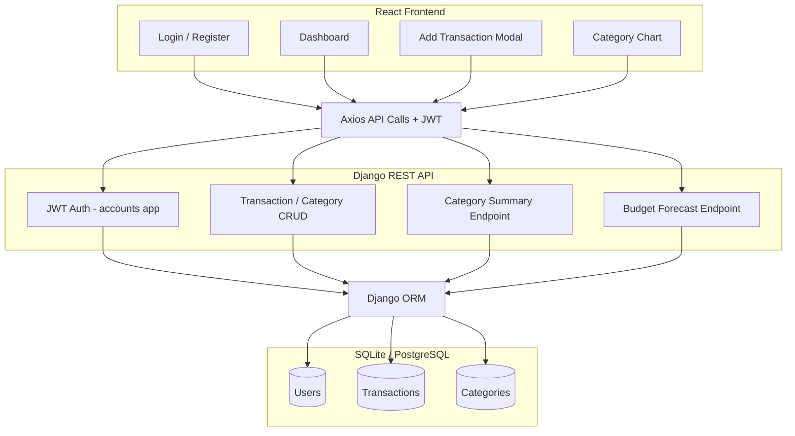
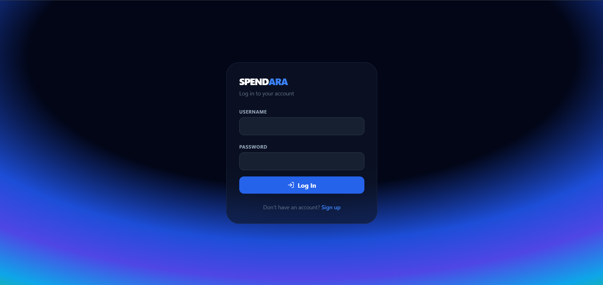
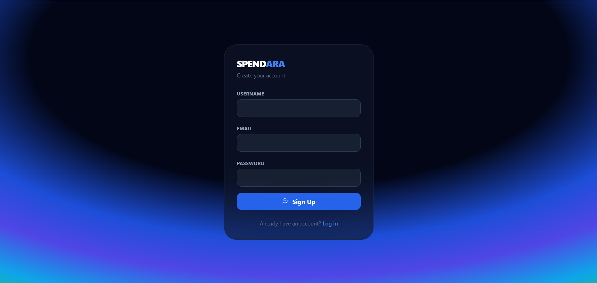
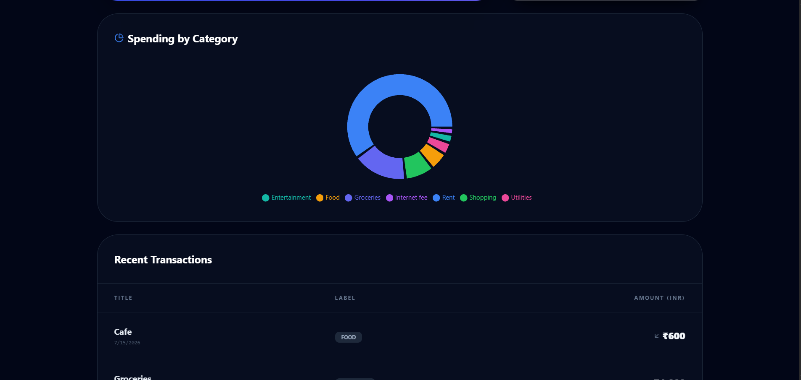
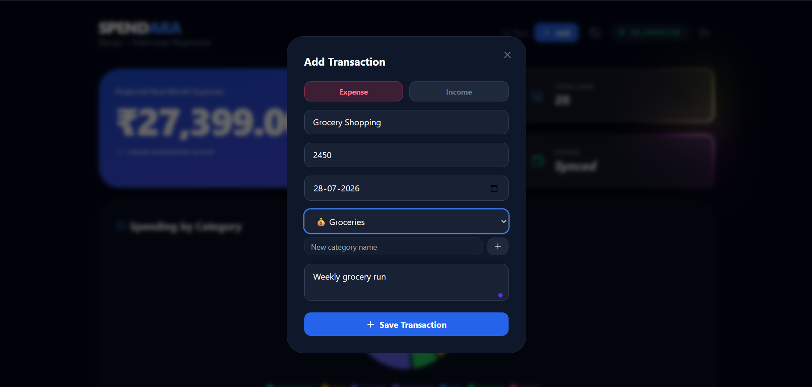

# 💰 Spendara

> AI-powered personal finance tracker with JWT authentication, ML-driven spending forecasts, and category-level insights.

[](https://www.djangoproject.com/)
[](https://www.django-rest-framework.org/)
[](https://reactjs.org/)
[](https://scikit-learn.org/)

<div align="center">
  
</div>

---

## 📋 Table of Contents

- [Features](#-features)
- [Tech Stack](#️-tech-stack)
- [Architecture](#️-architecture)
- [Installation](#-installation)
- [API Endpoints](#-api-endpoints)
- [Machine Learning](#-machine-learning)
- [Screenshots](#-screenshots)
- [Deployment](#-deployment)
- [License](#-license)

---

## ✨ Features

- **🔐 JWT Authentication** – Secure user registration and login, all data scoped per user
- **📊 Expense Tracking** – Add income/expense transactions with custom categories
- **📈 Spending Insights** – Category-wise spending breakdown via an interactive pie chart
- **🤖 ML-Powered Forecasts** – Predicts next month's total spending using Linear Regression on completed monthly totals (excludes the current, still-in-progress month to avoid skewed trends)
- **🎨 Polished UI** – Animated gradient backgrounds, cursor-tracking spotlight cards, and a custom circular loading spinner
- **🔄 Real-time Updates** – Instant feedback on actions with optimistic UI patterns

---

## 🛠️ Tech Stack

### Backend
| Technology | Purpose |
| :--- | :--- |
| **Django** | Web framework |
| **Django REST Framework** | REST API development |
| **Simple JWT** | Authentication |
| **Scikit-Learn** | ML forecasting (Linear Regression) |
| **Pandas / NumPy** | Data aggregation & processing |
| **SQLite** | Default local database (swappable for PostgreSQL in production) |

### Frontend
| Technology | Purpose |
| :--- | :--- |
| **React (Vite)** | UI framework |
| **React Router** | Client-side routing & protected routes |
| **Axios** | API calls with JWT interceptors |
| **Recharts** | Spending-by-category pie chart |
| **Framer Motion** | Animations (gradients, transitions, glow cards) |
| **Tailwind CSS** | Styling |

---

## 🏗️ Architecture



---

## 🚀 Installation

### Prerequisites
- Python 3.10+
- Node.js 18+
- pip

### Backend Setup

```bash
# Clone the repository
git clone https://github.com/IshitaSajeev/Spendara.git
cd Spendara

# Create virtual environment
python -m venv venv
source venv/bin/activate  # On Windows: venv\Scripts\activate

# Install dependencies
pip install django djangorestframework djangorestframework-simplejwt django-cors-headers pandas scikit-learn numpy

# Run migrations
python manage.py migrate

# Run the server
python manage.py runserver
```
Backend runs at `http://127.0.0.1:8000/`

### Frontend Setup

```bash
cd spendara_frontend

# Install dependencies
npm install

# Start development server
npm run dev
```
Frontend runs at `http://127.0.0.1:5173/`

**First use:** register a new account on `/register`, then log in — all transactions are scoped to your logged-in user.

---

## 📖 API Endpoints

| Method | Endpoint | Description |
| :--- | :--- | :--- |
| `POST` | `/api/auth/register/` | Create a new user account |
| `POST` | `/api/token/` | Log in, returns access + refresh JWT |
| `POST` | `/api/token/refresh/` | Refresh an expired access token |
| `GET` / `POST` | `/api/transactions/` | List or create transactions (user-scoped) |
| `GET` / `PUT` / `DELETE` | `/api/transactions/<id>/` | Retrieve, update, or delete a transaction |
| `GET` / `POST` | `/api/categories/` | List or create categories (user-scoped) |
| `GET` | `/api/categories/summary/` | Spending totals grouped by category (chart data) |
| `GET` | `/api/forecast/` | Next month's predicted spending (Linear Regression) |

### Sample API Call

```bash
# Login and get token
curl -X POST http://127.0.0.1:8000/api/token/ \
  -H "Content-Type: application/json" \
  -d '{"username": "demo", "password": "demo123"}'

# Get spending forecast
curl -X GET http://127.0.0.1:8000/api/forecast/ \
  -H "Authorization: Bearer <your_access_token>"
```

**Sample Response:**
```json
{
  "predicted_spending_next_month": 27399.0,
  "data_points_used": 20,
  "months_used": 2,
  "current_month_to_date": 19600.0,
  "message": "AI prediction generated using Linear Regression on completed monthly totals.",
  "algorithm": "Linear Regression (completed monthly totals)"
}
```

---

## 🤖 Machine Learning

The forecast model aggregates expenses into **calendar-month totals**, then fits a Linear Regression on `month_index → total_spent` to predict next month's total.

**Key design decision:** the current, still-in-progress month is excluded from training. Comparing a complete month against a partial one would make spending look artificially lower — not because you're spending less, but because the month simply isn't over yet. If fewer than 2 completed months exist, the model falls back to the last known total instead of guessing from insufficient data.

---

## 📸 Screenshots

| Login | Register |
|---|---|
|  |  |

| Spending Breakdown | Add Transaction |
|---|---|
|  |  |

---

## 🌐 Deployment

Not yet deployed. Planned stack:
- **Frontend:** Vercel
- **Backend:** Render
- **Database:** Neon or Supabase (PostgreSQL)

---

## 📄 License

Distributed under the MIT License. See `LICENSE` for details.

---

## 👩‍💻 Author

**Ishita Sajeev**
[GitHub](https://github.com/IshitaSajeev) · [LinkedIn](https://linkedin.com/in/ishita-sajeev)
